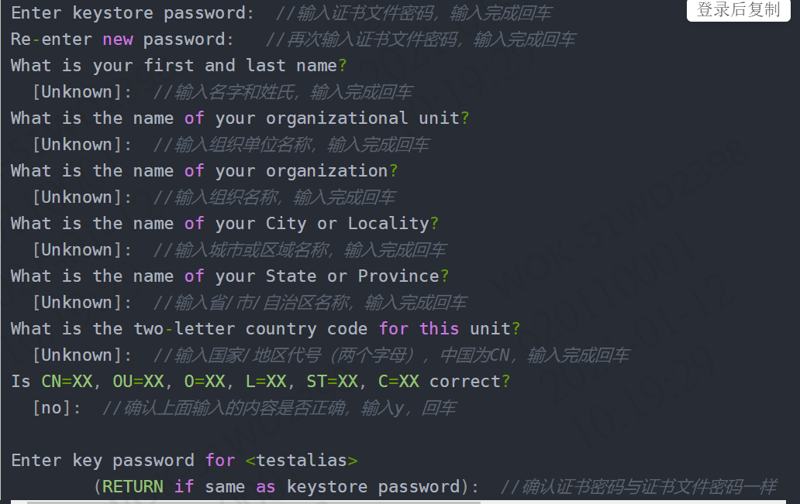
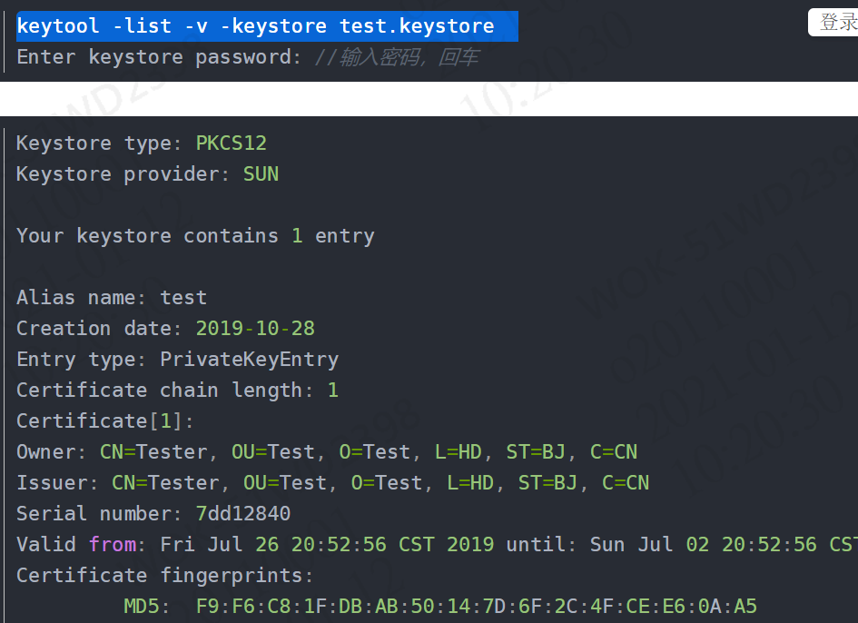
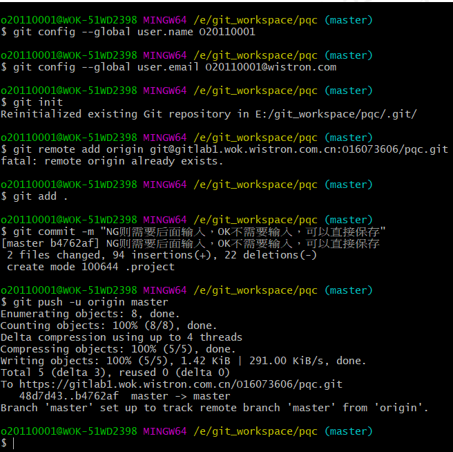

### SQL代码：

###设置主键自增从1开始

```
TRUNCATE TABLE 表名
```

####条件查询  条件显示：

```sql
select  form_id,(CASE WHEN file_type = 'O' THEN '外來文件' when file_type='G' then '技術文件' ELSE 'ISO文件' END) || '-' ||  (case when file_name is null then '' else file_name end)  as form_name,
            (case when router_stage2 = '0' then '新增'
                    when router_stage2 = '1' then '變更' else '作廢' end)as form_type,
             (case  when router_stage = '0' then '開立'
                    when router_stage = '1' then '送簽中'
                    when router_stage = '2' then '結案'
                    else '作廢' end) as form_state,
            create_user as form_employ,create_date as form_date
        from flow_system.flow_maintain_isofiles
```


### cmd方式结束进程

​		1、查看进程

```
netstat -ano | findstr 8080
```


​		2、结束进程

​	

```
	taskkill /F /PID 15716
```


### app重新打包

1、到10.57.30.111上

打开hbuilderX

发行-云打包

生成安卓证书（需要有jre的环境）：

使用keytool -genkey命令生成证书：

```
keytool -genkey -alias testalias -keyalg RSA -keysize 2048 -validity 36500 -keystore test.keystore
```



testalias是证书别名，可修改为自己想设置的字符，建议使用英文字母和数字
test.keystore是证书文件名称，可修改为自己想设置的文件名称，也可以指定完整文件路径

查看证书信息：

```
keytool -list -v -keystore test.keystore  
```



云打包配置：

**1>证书别名：生成证书时使用-alias参数设置的证书别名；
2>私钥密码：生成证书时使用的keystore密码；
3>证书文件：生成证书时使用-keystore参数设置的证书保存路径；**

**打包完成自动返回下载地址，点击链接下载APP安装

2、到10.57.30.102上

放C:\02.Website\API\TMP 文件夹里 改名PQC.apk

### git提交代码

鼠标右键打开git bash here:
<1>输入git config --global [user.name](http://user.name/) “你的用户名”
<2>输入git config --global user.email “你的邮箱”
<3>输入git init
<4>输入git remote add origin 你刚才建立的项目连接

```
<5>输入git add .
<6>输入git commit -m “注释”
```

<7>输入git config http.postBuffer 524288000 (特别提醒: 此行是在本地设置缓存, 有些项目文件较大, 使用http无法上传,可设置此命令)

```
<8>输入git push -u origin master 将代码推送到gitlab端
```



```
git remote add origin https://github.com/wyh136136/springcloud-study.git
git branch -M master
git push -u origin master
git config --system http.sslcainfo "E:/Git/mingw64/ssl/certs/ca-bundle.crt"  
```